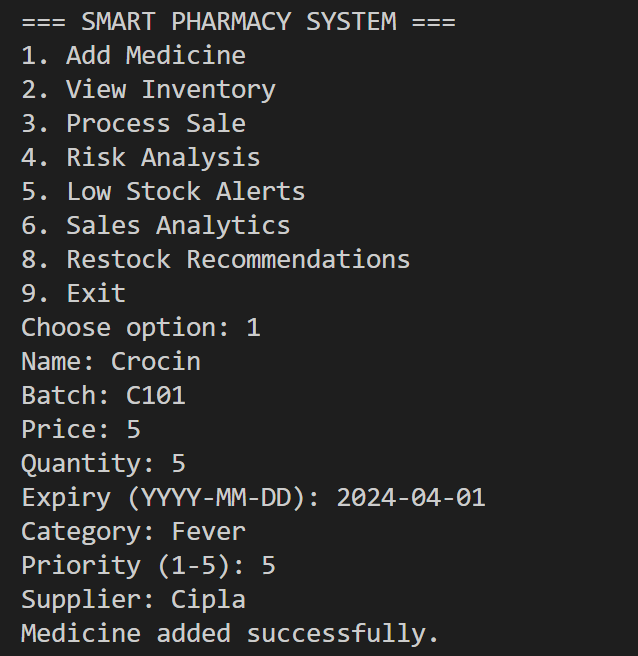
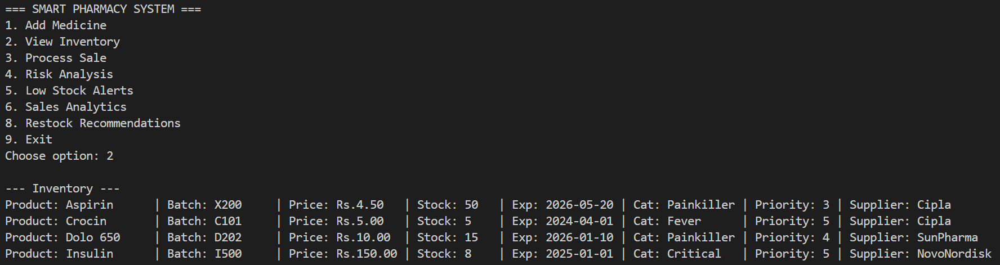
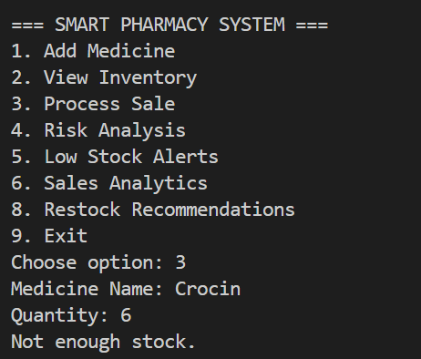
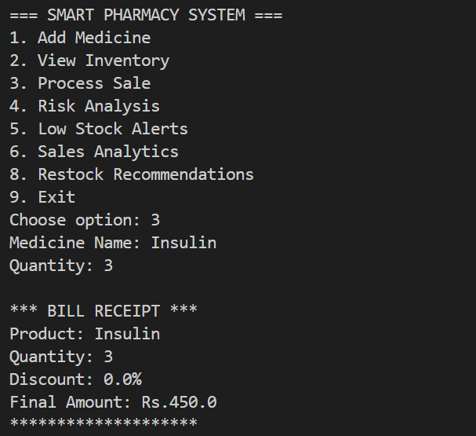
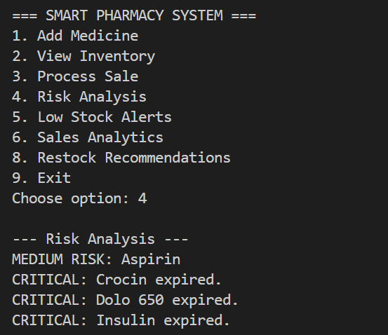
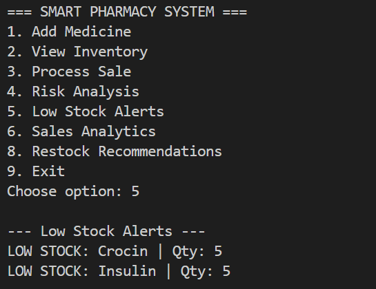
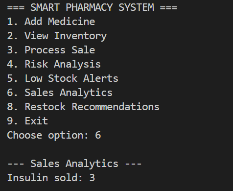
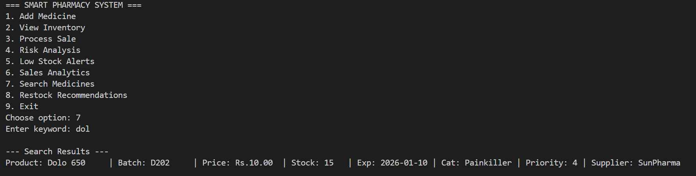
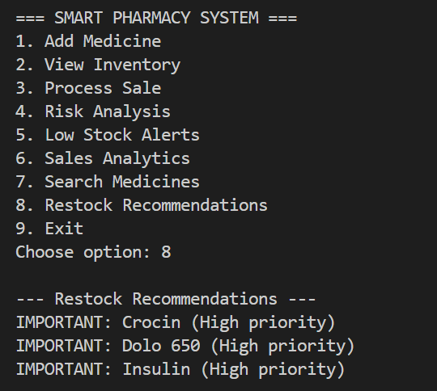

# PharmaTrack - Smart Pharmacy Inventory & Risk Management System

## Overview

PharmaTrack is a Java-based console application designed to assist small medical stores in managing their inventory efficiently. Unlike basic inventory systems, this project integrates stock monitoring, expiry risk detection, sales tracking, and intelligent restock suggestions into a single lightweight solution.

The goal of this project is to reduce manual errors, prevent the sale of expired medicines, and support better decision-making in day-to-day pharmacy operations.

---

## Problem Statement

Managing a pharmacy manually or using spreadsheets often leads to:

* Difficulty tracking stock levels
* Risk of selling expired medicines
* No visibility into fast-selling products
* Inefficient restocking decisions

PharmaTrack addresses these problems by automating inventory tracking and adding smart analytical features.

---

## Key Features

### 1. Medicine Inventory Management

* Add medicines with details like batch, price, expiry date, category, priority, and supplier
* View complete inventory in structured format

### 2. Smart Billing System

* Process sales with automatic stock deduction
* Discount applied for bulk purchases
* Generates a simple receipt

### 3. Expiry Risk Analysis

* Detects expired medicines
* Flags medicines nearing expiry (within 30–90 days)
* Helps prevent unsafe usage

### 4. Low Stock Alerts

* Automatically identifies medicines with low quantity
* Prevents stock-out situations

### 5. Sales Analytics

* Tracks how many units of each medicine are sold
* Helps identify high-demand products

### 6. Search Functionality

* Search medicines by name (partial match supported)

### 7. Smart Restock Recommendation (Unique Feature)

* Suggests medicines that need restocking based on:

  * Low stock
  * Sales trends
  * Priority level
* Categorizes recommendations as:

  * URGENT
  * IMPORTANT
  * SUGGESTED

---

## Project Structure

```
src/
 ├── model/
 │    └── Medicine.java
 ├── service/
 │    ├── InventoryService.java
 │    └── BillingService.java
 ├── util/
 │    └── FileHandler.java
 └── main/
      └── App.java
```

---

##  Application Screenshots

###  1. Adding Medicines & Main Menu



---

###  2. Inventory Display



---

###  3. Process Sale


<br><br>


---

###  4. Risk Analysis



---

###  5. Low Stock Alerts



---

###  6. Sales Analytics



---

###  7. Search Medicines



---

###  8. Restock Recommendations



---

## Technologies Used

* Java (JDK 8 or above)
* Object-Oriented Programming (OOP)
* File Handling (for data persistence)
* Collections Framework (ArrayList, HashMap)

---

## How to Run

1. Open terminal in project root folder

2. Compile:

```
javac main/App.java
```

3. Run:

```
java main.App
```

---

## Data Storage

* Data is stored in a file named `pharmacy_db.txt`
* Uses a structured comma-separated format
* Automatically loads data on startup

---

## Sample Use Flow

1. Add medicines to inventory
2. View stock details
3. Process sales
4. Check expiry risk
5. Monitor low stock
6. Analyze sales trends
7. Get restock recommendations

---

## Learning Outcomes

Through this project, the following concepts were applied:

* Class design and modular architecture
* Separation of concerns (model, service, util)
* File handling and data persistence
* Real-world problem modeling
* Basic analytics and decision logic

---

## Future Improvements

* GUI interface using Java Swing or JavaFX
* Database integration (MySQL)
* Multi-user authentication system
* Graphical sales reports
* Barcode scanning support

---

## Conclusion

PharmaTrack goes beyond a simple inventory manager by incorporating intelligent features that assist in real-time decision-making. It demonstrates how core Java concepts can be used to build a practical and impactful solution for everyday problems in pharmacy management.

---

## Author

Developed by Raghav Khare as part of the Programming in Java BYOP course project.